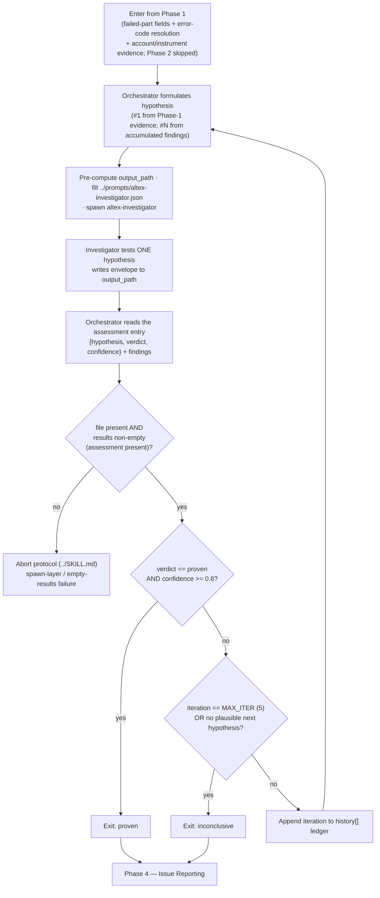

# Phase 3 — Investigation Loop

The diagnostic core. The orchestrator formulates a hypothesis about the single failed part, spawns the `altex-investigator` sub-agent to test it, reads back the verdict, and either exits or formulates the next hypothesis from what the investigator found. Up to `MAX_ITER = 5` iterations.

## Division of labour

The split is strict and does not change as iterations proceed:

- **Orchestrator (main thread, this file).** Formulates **every** hypothesis (the investigator never invents one), fills the spawn prompt, spawns the investigator, reads back the assessment, keeps the running `history[]` ledger, and decides exit-vs-continue.
- **`altex-investigator` (sub-agent).** Tests the **one** hypothesis it is handed, gathers evidence (Loki + altex-DB + code + web), and renders `verdict` + `confidence` + `findings`. The orchestrator does **not** read the agent definition (Rule 1) — the agent owns its own procedure, tool budgets, and result shape.



## Entry state

The orchestrator arrives holding, from Phase 1 (in memory + on disk under `runs/<task_id>/`):

- The pinned **failed part** (`failed-part.json`) and its **failed phase** (`transfer` / `source_recon` / `dest_recon`) with the failed-phase error log field.
- The **error-code resolution** (`error-code-resolver-<ts>.json`), present only if the failed phase was `transfer` and a code was detected.
- The **account** and **instrument** context (`account-discoverer-<ts>.json`, `instrument-discoverer-<ts>.json`).
- The **transfer record** (`transfer-discoverer-<ts>.json`).

## Hypothesis #1 formulation (D2)

The orchestrator reads the Phase-1 evidence into a single, falsifiable first hypothesis — the most likely root cause given what is already known.

Account/instrument anomalies (an inactive instrument, an exchange-backed product missing its `exchange_uid`/`api_key_name`, a non-normal account status) sharpen or redirect the hypothesis.

> [!NOTE]
> **Future playbook-bias hook.** When Phase 2 is re-enabled, its ranked `playbook/index.toon` matches will *bias* this choice — the orchestrator would prefer a hypothesis matching a known signature. The loop structure is unchanged: still one hypothesis formulated and tested per iteration.

## Iteration mechanics

Per iteration `i` (1-based):

1. **Pre-compute `output_path`** = `runs/<task_id>/altex-investigator-<ts>.json`, where `<ts>` is a fresh UTC ISO-8601 stamp with `Z` and no colons in the filename (per `../docs/agent-output-format.md`). One file per iteration — never overwrite a prior iteration's file.
2. **Fill `../prompts/altex-investigator.json`** (D7):
   - `output_path` — the value just computed.
   - `hypothesis` — the orchestrator-authored hypothesis, **verbatim**.
   - `evidence_digest` — compact key fields: `failed_phase`, `failed_part` (the key fields + failed-phase error log field), `error_code` summary (or `null`), `account_anomalies` / `instrument_anomalies` (short notes or `null`), and `loki_time_window` (see below).
     - **`loki_time_window` (orchestrator pre-computes — the investigator has no shell).** The failed part's `start_time` / `transfer_time` are **Unix epoch seconds in UTC**; convert them to RFC3339-UTC (`…Z`) and hand the investigator ready bounds — Loki query bounds are UTC, no offset applied (rationale + recipe in `docs/timezones.md`). **Span** follows `docs/logging-and-loki.md` § 7, and the two anchor instants depend on the failed phase (pad ±5 min for clock skew + listener-start latency):
       - **`transfer`-phase failure** — the leg itself failed. `start_rfc3339` = (`transfer_time` if present, else `start_time`) − 5 min; `end_rfc3339` = `transfer_time` + 5 min.
       - **`source_recon` / `dest_recon` failure** — the recon listener spawns just after the leg executes and lives until the terminal status is written. Anchor on the part's own business timestamps, **not** `now`: `start_rfc3339` = **`transfer_time`** − 5 min (when the listener spawns); `end_rfc3339` = **`start_time`** + 5 min (the failed version row is written when recon resolves, so `start_time ≥ transfer_time` always brackets the listener lifetime — including settlement-engine recon re-arms that span several listener lifetimes). **Do not anchor the start on `start_time`** — it is the version-write instant ≈ recon-*resolution* time (hours after the listener's first lines), so it opens the window too late and silently misses the early recon log lines. This bounded `transfer_time → start_time` span also replaces the old unbounded `… → now`, cutting the Loki scan on older post-mortems.
       - **In-flight part** (no `transfer_time`, recon may still be running) — `start_rfc3339` = `start_time` − 5 min; `end_rfc3339` = current UTC instant (`now`). The only genuinely open-ended case.

       Compute via Bash, e.g. `python3 -c "from datetime import datetime,timezone as Z; f=lambda t: datetime.fromtimestamp(t,Z.utc).strftime('%Y-%m-%dT%H:%M:%SZ'); print(f(<transfer_time>-300), f(<start_time>+300))"` for a recon-phase window (use `datetime.now(Z.utc)` for the end only on an in-flight part).
   - `evidence_files` — the raw Phase-1 JSON **paths** for drill-down (not inlined).
   - `history` — the running ledger so far (empty `[]` on iteration 1).
3. **Spawn** `altex-investigator` by `subagent_type` with the filled JSON object as the bare prompt. The investigator writes its envelope to `output_path` and replies with that bare path.
4. **Read back** the file at `output_path`, parse it, and locate the reserved entry where `label == "assessment"`. Read `rows[0]` (`hypothesis`, `verdict`, `confidence`) and `extra.findings`.

## Reading the result

| Outcome | Meaning | Action |
|:---|:---|:---|
| No file at `output_path`, or the spawn failed/timed out | Spawn-layer failure | **Abort** (`../SKILL.md` § Abort protocol). |
| File present but `results` is **empty** (no `assessment` entry) | Infra failure — the investigator never produced usable output (malformed prompt / agent died) | **Abort** (`../SKILL.md` § Abort protocol). |
| `assessment` present, `verdict == "proven"` AND `confidence >= 0.8` | Root cause established | **Exit: proven** → Phase 4. |
| `assessment` present, any other verdict/confidence (incl. `inconclusive` with zero evidence rows) | A **valid** result, **not** an abort | Record + decide next step (below). |

> [!IMPORTANT]
> A valid `inconclusive` (or a sub-threshold `proven`, or a `disproven`) is **never** an abort. Abort is reserved for spawn-layer failure and empty-`results`. A `disproven` verdict alone never early-exits — it only informs the next hypothesis.

## Ledger

After each iteration the orchestrator appends one entry to the running `history[]` (passed into the next spawn):

```json
{ "hypothesis": "<tested, verbatim>", "verdict": "<…>", "confidence": 0.0, "key_findings": ["<short claim from extra.findings>"] }
```

`key_findings` is a compact distillation of the iteration's `extra.findings[].claim` values — enough for the next hypothesis without re-reading the file.

## Next-hypothesis formulation (iteration N+1)

If the loop did not exit, the orchestrator uses the latest `findings` (D6) to steer the next hypothesis:

- A **`disproven`** verdict eliminates a branch — pivot to the next most likely cause the evidence now points at (the `findings` evidence prose names the `results[]` labels worth following).
- A **sub-threshold `proven`** or **`inconclusive`** with a partial lead — sharpen the **same** suspected cause with a more direct query (a narrower Loki filter, a specific DB row, a code path), framed as a new, tighter hypothesis.
- Never re-issue a hypothesis already in `history[]`.

## Termination (D10)

The loop ends on the **first** of:

- **Success.** `verdict == "proven" && confidence >= 0.8` → exit proven.
- **Iteration cap.** `iteration == MAX_ITER (5)` reached without success → exit inconclusive.
- **Hypothesis exhaustion (early stop).** The orchestrator cannot formulate a plausible, untested next hypothesis from the accumulated findings → stop early, exit inconclusive. (Better than spending iterations on implausible guesses.)

On an inconclusive exit, the report's verdict is "Inconclusive — …" and the Open questions section is required.

## Handoff to Phase 4

The orchestrator carries out of the loop everything `../templates/success-report-template.md` needs:

- The **per-iteration assessments** — `{ hypothesis, verdict, confidence }` for each iteration, in chronological order → the report's **Hypotheses tested** section.
- The winning iteration's **findings** (`{ claim, evidence }`) → the **Verdict** + **Suggested fix** synthesis.
- The investigator **evidence pointers** — each `runs/<task_id>/altex-investigator-<ts>.json` and the `loki:`/`db:`/`code:`/`web:` entries inside → the **Loki excerpts**, **Code references**, **Queries run**, and **Raw agent outputs** sections (the up-front log-diggers being SKIPPED, Loki excerpts are re-sourced from the investigator's `loki:` entries).

Phase 4 (`./4-issue-reporting.md`) writes the report and, since Phase 2 is skipped, prompts to capture the finding into the playbook whenever a verdict was reached.
