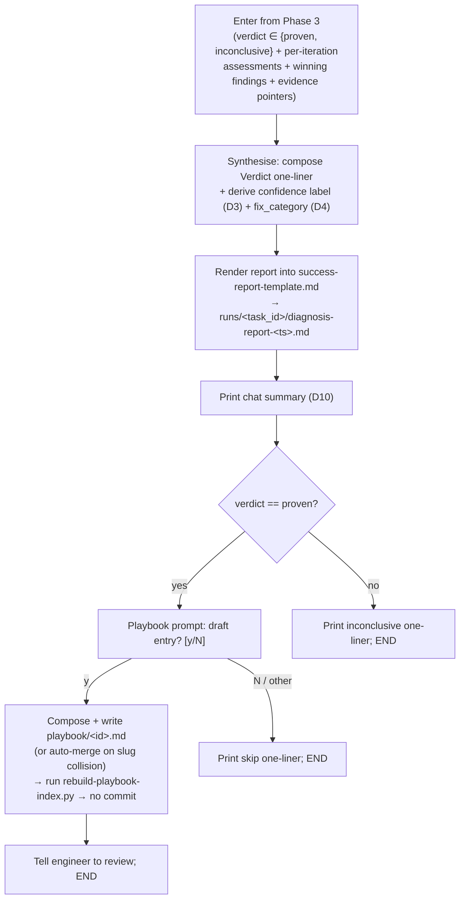

# Phase 4 — Issue Reporting

The synthesis terminus. The orchestrator turns everything Phase 3 carried out of the investigation loop into a single diagnosis report on disk, prints a short chat summary, and — only when a root cause was proven — offers to capture the finding as a playbook entry. No new evidence is gathered here; Phase 4 is pure rendering + the playbook hand-off.

> [!IMPORTANT]
> **Phase 4 is the verdict-reached path only.** It runs **only** on a Phase-3 exit of `proven` or `inconclusive` (D2). Every other terminus stops earlier and never reaches here: the Phase-1 clean-stops (task-not-found, no-failed-part — each prints a one-liner and writes **no** report) and every infra abort (`../SKILL.md` § Abort protocol, which writes the failure report). There is no "task already completed" short-circuit report — Phase 1 hard-stops that case with no report. Failure-report rendering is owned by the Abort protocol, not this phase (D6).



## Entry state

The orchestrator arrives holding everything `../templates/success-report-template.md` needs (mirrors Phase 3's "Handoff to Phase 4"):

- The **verdict** — `proven` or `inconclusive` (the only two that reach here, per D2).
- The **per-iteration assessments** — `{ hypothesis, verdict, confidence }` for each Phase-3 iteration, in chronological order → the **Hypotheses tested** section.
- The winning iteration's **findings** (`{ claim, evidence }`) on a `proven` exit → the **Verdict** + **Suggested fix** synthesis. On `inconclusive` there is no winner; the leading sub-threshold finding (if any) seeds the Open questions.
- The investigator **evidence pointers** — each `runs/<task_id>/altex-investigator-<ts>.json` and the `loki:` / `db:` / `code:` / `web:` entries inside → the **Loki excerpts**, **Code references**, **Queries run**, and **Raw agent outputs** sections.
- The **Phase-1 artifacts** under `runs/<task_id>/`: `failed-part.json` (the pinned failed part + its failed-phase error log field), `transfer-discoverer-<ts>.json`, `account-discoverer-<ts>.json`, `instrument-discoverer-<ts>.json`, and `error-code-resolver-<ts>.json` **only when** the failed phase was `transfer` and a code was detected.

## Synthesis rules

### Verdict one-liner

The orchestrator composes a single-sentence root cause:

- **`proven`** — a declarative sentence naming the actual defect, grounded in the winning finding's `claim` + `evidence`. Specific (the file/feed/config that is wrong), not a restatement of the hypothesis label.
- **`inconclusive`** — an `"Inconclusive — <why>"` sentence (iteration cap reached, or hypotheses exhausted, with the furthest the evidence got).

This becomes the bold first line of the report's `## Verdict` and the first line of the chat summary.

### Confidence label (numeric → categorical) — D3

Derive the report's categorical confidence from the **winning** hypothesis's numeric `confidence ∈ [0.0, 1.0]` and the exit verdict. The loop success-gate is `proven && confidence >= 0.8`, so a `proven` exit is always `high` or `medium`:

| Exit | Numeric confidence | Label |
|:---|:---|:---|
| `proven` | `>= 0.9` | `high` |
| `proven` | `0.8 <= conf < 0.9` | `medium` |
| `inconclusive` | a leading sub-threshold hypothesis exists (partial lead) | `low` |
| `inconclusive` | no plausible lead | `inconclusive` |

### `fix_category` derivation — D4

The **orchestrator** derives `fix_category` here in Phase 4 from the proven finding — the Phase-3 investigator does **not** emit it (its assessment contract is `{hypothesis, verdict, confidence}` + `findings[]` only; Phase 3 is untouched). Pick exactly one bucket — the same four the playbook uses (`playbook/README.md`), plus `n/a`:

| Bucket | Means |
|:---|:---|
| `code_bug` | A defect in one of the service repos (logic, missing code path, wrong field threading). |
| `optimus_config` | An Optimus / Altonomy-side configuration error (account, product, instrument, routing setup). |
| `exchange_config` | A venue-side setting (e.g. API-key IP allowlist, withdrawal permissions, sub-account wiring). |
| `external_service` | An upstream / chain / venue outage or failure outside our control. |
| `n/a` | Inconclusive run — no root cause proven, so no category. |

## Report rendering

Render into `../templates/success-report-template.md`, section by section, in the template's order. Each section is sourced from the evidence below; omit a section exactly where the template's parenthetical says to.

- **`Verdict`** — the one-liner + the D3 confidence label + the D4 `fix_category` (on `inconclusive`, confidence is `low`/`inconclusive` and `fix_category` is `n/a`).
- **`Hypotheses tested`** — one entry per Phase-3 iteration, chronological: the hypothesis (verbatim), its `verdict`, its numeric `confidence`, and the iteration's `altex-investigator-<ts>.json` evidence pointer. A one-clause parenthetical on a disproven/sub-threshold iteration (what it ruled out / where it pointed next) is welcome.
- **`Evidence`**:
  - **`Failed part`** — a **left-aligned two-column Markdown table** (`| Field | Value |`, `:---` alignment) of the `failed-part.json` key fields, per D5.
  - **`Failed part summary`** — 1–2 sentences: which group matched (`live` / `historical`), the failed-phase `(status, recon_src, recon_dest)` triple, and what the error log field shows.
  - **`Part logs`** — `txn_log` / `recon_src_log` / `recon_dest_log`, each **truncated to ≤ 500 chars** with a `[...truncated]` marker when longer (bulky embedded blobs such as a recon log's `raw.data` may be summarised in a parenthetical rather than dumped). A field that is `null` is shown as `null`.
  - **`Exchange error code`** — **omit** if Phase 1 detected no exchange error code (i.e. failed phase ≠ `transfer`, or no code found). When present, source it from `error-code-resolver-<ts>.json`.
  - **`Account context`** — the orchestrator's reading of `account-discoverer-<ts>.json`, focused on anomalies (non-normal status, missing `exchange_uid`/`api_key_name` on an exchange-backed product) or an explicit "nothing anomalous".
  - **`Instrument context`** — same, from `instrument-discoverer-<ts>.json`.
  - **`Loki excerpts`** — sourced from the investigator iterations (up-front log-diggers are SKIPPED). For each `loki:<…>` entry that returned **≥ 1 hit AND informed the verdict**, include the label, the LogQL line, and up to ~5 representative log lines.
- **`Code references`** — **omit** if no iteration surfaced code. Otherwise one bullet per `code:` reference: `<repo>/<path>:<line>` + a one-line role + a small (±5 line) context block.
- **`Raw agent outputs`** — the per-spawn JSON paths that fed the synthesis. The two log-digger bullets stay **struck/SKIPPED**; the `error-code-resolver` bullet appears only when a code was detected; one `altex-investigator-<ts>.json` bullet per iteration; plus `failed-part.json`.
- **`Playbook match`** — Phase 2 (lookup) is SKIPPED, so render the skipped-regime line the template carries: lookup skipped (pending population); hypothesis #1 was minted directly from Phase-1 evidence; on a clean signature, point at the prompt below.
- **`Suggested fix`** — Phase 2 is skipped so there is never a matched entry to pull from; compose one paragraph from the synthesis. Distinguish **immediate unblock** vs **permanent fix** when both apply.
- **`Open questions`** — **required** when the verdict is `inconclusive`; otherwise omit if confidence is `high` and no gaps remain.
- **`Queries run (relevant)`** — per-source one-liners: Settlement Engine API (which group matched + failed part/phase), Account API, Instrument API, Loki (the investigator's on-demand `loki:` filters that informed the verdict — up-front diggers SKIPPED), error-code lookup (omit if no code), and a per-iteration investigation-loop summary.

### Report path + timestamp

Write to `runs/<task_id>/diagnosis-report-<ts>.md` (relative to the repo root). The timestamp is UTC ISO-8601 with a `Z`, computed via Bash per `docs/timezones.md` — **no colons in the filename**, colons allowed in the in-body "Generated …" line:

```bash
TS=$(date -u +%Y-%m-%dT%H%M%SZ)        # filename stamp, e.g. 2026-06-16T123110Z
GEN=$(date -u +%Y-%m-%dT%H:%M:%SZ)     # in-body "Generated <…>" stamp, e.g. 2026-06-16T12:31:10Z
```

## Chat summary — D10

After the report is written, print this to chat. Plain English, **not** caveman — this is an artifact-adjacent summary, not chat ephemera (Rule 3):

```
[<task_id>] <verdict one-liner> (confidence: <high|medium|low|inconclusive>)
Fix category: <category|n/a>
Report: runs/<task_id>/diagnosis-report-<ts>.md
```

Then branch on the verdict:

- **`proven`** → continue to the playbook prompt below.
- **`inconclusive`** → no prompt. Print one line and end, e.g. `No root cause proven — re-run after gathering more evidence, or hand-author a playbook entry once the cause is found.`

## Playbook prompt + draft — D7 / D8 / D9

Gated on a **`proven`** exit only (D7). An `inconclusive` run has nothing confirmed to encode, so it never prompts.

Prompt: `Capture this as a playbook entry? [y/N]`.

- **`N` / anything but `y`** → skip with a one-liner, e.g. `Skipped playbook capture.` End.
- **`y`** → compose and write a draft, regenerate the index, **do not commit** (D8):

  1. **Compose frontmatter** per the schema in `playbook/README.md` (the source of truth — do **not** duplicate it here). Source each field from the run:
     - `id` — kebab-case slug from the verdict one-liner (the filename without `.md` must equal it).
     - `title` — the verdict one-liner, trimmed to ~80 chars.
     - `signature.phase` — the failed phase (`transfer` / `source_recon` / `dest_recon`).
     - `signature.task_type` — `transfer_task.task_type` (`internal` / `external incoming` / `external outgoing`), or `"*"`.
     - `signature.transfer_method` — the failed part's `transfer_method` value literally, or `"*"` if rail-agnostic.
     - `signature.exchange` — the lowercased adapter name, or `"*"`.
     - `signature.fix_category` — the D4 bucket just derived.
     - `signature.error_patterns` — the 2–4 most distinctive **literal** substrings from `txn_log` / the Loki excerpts, dropping UUIDs, bare numbers, and timestamps (keep stable tokens like `-2015`, `IP not in whitelist`, an endpoint path).
     - `last_seen` — today's UTC date, `date -u +%F`.
     - `example_task_ids` — `[<task_id>]`.
     - `affected_repos` — drawn from the report's Code references / Suggested fix, ordered by relevance.
  2. **Compose the body** — `Root cause`, `Diagnostic steps`, `Fix`, `References` — from the report's synthesis sections.
  3. **Write** `playbook/<id>.md`.
  4. **Regenerate** the index: run `./scripts/rebuild-playbook-index.py` from the repo root (exit 0 expected; 2 = malformed frontmatter to fix).
  5. **Do not commit.** Tell the engineer the draft + regenerated `index.toon` are uncommitted and to review/edit before staging.

### Slug collision — auto-merge (D9)

If `playbook/<id>.md` already exists, **read it first** before writing:

- **Same root cause** (the existing entry describes this same defect) → do **not** write a duplicate. Append `<task_id>` to its `example_task_ids` and bump `last_seen` to today's UTC date, then re-run `./scripts/rebuild-playbook-index.py`. Tell the engineer it was merged into the existing entry.
- **Different cause that merely slug-collided** → disambiguate: pick a more specific slug and write a fresh draft at the new path, then regenerate.

Either way: no commit; tell the engineer.

> [!NOTE]
> `index.toon` projects nine columns and `example_task_ids` is **not** one of them — appending a task_id alone leaves `index.toon` byte-identical; bumping `last_seen` is what re-renders the row. The rebuild script is still re-run after a merge so the projection always reflects the current frontmatter.
