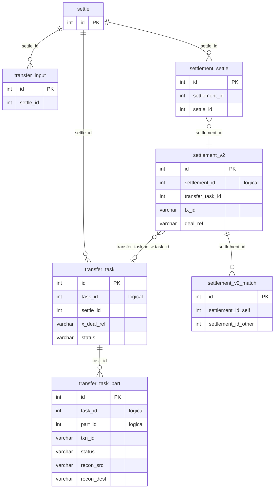

# Altex — Database Schema

Altex MySQL DB (`mysql_query` via `mysql_clientdb_altex` MCP) = single source of truth for settlement-engine workflow: transfer-task state machine, settlement obligations behind tasks, audit trail of every state change, plus peripheral concerns (init balances, client reports, job bookmarks). DB playbook for investigating transfer — schema, bitemporal versioning model, active-version predicates, cross-reference keys, copy-pasteable query cookbook keyed to "given part / task_id / settlement, prove X".

ORM in `sg-altonomy-settlement-engine` = schema source of truth. Column/enum claims below anchored to `TransferTask` / `TransferTaskPart` / `SettlementV2` (and siblings) in `altonomy.settlement_engine.models`, and enums in `altonomy.settlement_engine.enums`. Row-count figures stamped "approx, as of 2026-06-15" — will drift.

See also:

- `logging-and-loki.md` — `recon_id_src` / `recon_id_dest` = cross-service log
  anchor; `txn_log` / `recon_*_log` JSON columns surface in logs.
- `error-codes.md` — `transfer_task_part.txn_log` embeds vendor/local error codes;
  decode there.
- `altex-overview.md` — product context for these tables.
- `timezones.md` — stored `datetime` instants are UTC, **but a bare `SELECT <col>` over
  this MCP comes back host-offset-shifted and falsely tagged `Z`.** Read times UTC-safe via
  `UNIX_TIMESTAMP(col)` / `DATE_FORMAT(col,'…Z')` / `CAST(col AS CHAR)` — see § 5.

---

## 1. Big picture

2 conventions dominate schema:

1. **Task workflow around `TransferTask` / `TransferTaskPart`.** Task = operator-requested
   fund movement; Part = one leg of execution. Task carries header status; each Part
   carries per-leg state — transfer-initiation status plus 2 recon outcomes (source +
   destination), independently.
2. **Bitemporal versioning on every business-critical table.** No record updated in
   place. "Update" inserts new row, stamps previous row's `end_time` (or `valid_to`) with
   current timestamp. Active version of any logical entity = row where `end_time IS NULL`
   (or `valid_to IS NULL`).

DB small in cardinality (15 objects), dense in semantics. Hot-path tables:
`transfer_task_part` and `settlement_v2`; `transfer_task` third. Approx magnitudes, as of
2026-06-15:

| Table                | Rows (total) | Active (`end_time` / `valid_to` `IS NULL`) |
| :------------------- | -----------: | -----------------------------------------: |
| `transfer_task_part` |       ~1.43M |                                      ~186k |
| `settlement_v2`      |        ~775k |                                      ~349k |
| `transfer_task`      |        ~248k |                                      ~108k |

`settlement` — v1 settlement table — holds **0 rows** (re-verified 2026-06-15),
functionally dead; new code paths write only to `settlement_v2`.

---

## 2. The bitemporal versioning model

Most Altex tables follow one of 2 near-identical patterns for tracking history of a
logical record. Differ in column naming, not semantics.

### 2.1 The `start_time` / `end_time` pattern (transfer tables)

Used by `transfer_task` and `transfer_task_part`.

- `id` — physical primary key, auto-incremented per row insert.
- `task_id` (and `part_id` for parts) — **logical identifier**. Constant across versions.
- `start_time` — when this *version* came into effect.
- `end_time` — when superseded. `NULL` ⇒ **currently active version.**

Every production read filters on active predicate, e.g.:

```python
db.query(TransferTask).filter(
    TransferTask.task_id == task_id,
    TransferTask.end_time.is_(None),
).first()
```

`end_time.is_(None)` filter pervasive across `transfer_task_dao` and
`transfer_task_part_dao` in `altonomy.settlement_engine.daos`. Update = **stamp-old +
insert-new**: `TransferCtrl.set_task_status` in
`altonomy.settlement_engine.ctrls.transfer_ctrl` stamps `task.end_time = now` on old row,
inserts fresh `TransferTask` sharing same `task_id`; part-level equivalent =
`TransferCtrl.update_part` (`part.end_time = now`). Consequence: task updated 36 times has
36 physical rows sharing one `task_id`, exactly one with `end_time IS NULL`.

### 2.2 The `valid_from` / `valid_to` pattern (settlement and report tables)

Used by `settlement`, `settlement_v2`, `init_balance`, `client_activity_report`.

- `id` — physical primary key.
- `settlement_id` (or `init_balance_id`, `report_id`) — logical identifier, constant
  across versions.
- `version` — monotonic integer counter, bumped each new version.
- `valid_from` — when version came into effect.
- `valid_to` — when superseded. `NULL` ⇒ currently active.

`settlement_v2` additionally carries `system_record_time` (when row physically inserted,
distinct from `valid_from` = business-time perspective). Supports audit-style "as-of"
queries and proper temporal joins; settlement DAO uses it for point-in-time reads
(`valid_from <= valid_at < valid_to`, falling back to current version when
`valid_to IS NULL`).

> Note: `settlement_v2_match` = exception — carries `valid_from` and `system_record_time`
> but **no** `valid_to` / `version`. Append-only, not full SCD-2: each row records one
> match event, never superseded.

### 2.3 Why 2 patterns

`transfer_task*` built first with `start_time` / `end_time`; settlement and report tables
later adopted conventional `valid_from` / `valid_to` SCD-2 terminology. Semantics
equivalent. Both coexist, unlikely to be unified.

### 2.4 The active-version predicate (read this before any ad-hoc query)

Any non-historical query must include active-version predicate:

- transfer tables → `end_time IS NULL`
- settlement / report tables → `valid_to IS NULL`

Omitting = most common ad-hoc-SQL mistake: query silently returns one row per past
version, multiplying counts, surfacing stale values. DAOs always include it; ad-hoc SQL
must too.

---

## 3. Table inventory

15 objects: 14 tables plus `vw_outstanding` (view), grouped by role.

### 3.1 Task workflow (the heart of the schema)

#### `transfer_task` — Task header

One logical task = one `task_id` = many physical rows (one per version). Anchored to
`TransferTask` in `models.py`.

| Column                       | Type             | Purpose                                                                                                  |
| :--------------------------- | :--------------- | :------------------------------------------------------------------------------------------------------- |
| `id`                         | `int PK`         | Per-version row id.                                                                                       |
| `task_id`                    | `int`            | Logical task id; constant across versions.                                                               |
| `settle_id`                  | `int`            | Links to `settle.id` if task created from settle operation.                                              |
| `x_deal_ref`                 | `varchar(255)`   | XAlpha deal reference if task settles OTC deal.                                                          |
| `task_create_time`           | `datetime(6)`    | When task originally created (constant across versions).                                                |
| `start_time` / `end_time`    | `datetime(6)`    | Bitemporal window of version. Active = `end_time IS NULL`.                                               |
| `task_type`                  | `varchar(255)`   | `internal`, `external incoming`, `external outgoing` (`TransferTaskType` enum).                          |
| `account_src` / `account_dest` | `varchar(255)` | Optimus account-product ids (string-encoded). `account_src IS NULL` ⇒ incoming task.                     |
| `asset`                      | `varchar(255)`   | Token symbol.                                                                                            |
| `amount`                     | `decimal(40,20)` | Task headline amount. Parts may sum differently if fees applied.                                        |
| `txn_fee`                    | `decimal(40,20)` | Fee at task level (legacy; per-part fee config in `fee` table).                                          |
| `settlement_leg`             | `varchar(255)`   | Which leg of multi-leg settlement this task fulfils.                                                     |
| `maker_id`, `checker_id`     | `int`            | User ids (from account system) for audit / dual-control.                                                 |
| `task_tag`                   | `varchar(255)`   | `system` (machine-created) or `manual` (`TransferTag` enum).                                            |
| `status`                     | `varchar(255)`   | Task status — see §6.                                                                                    |
| `extra`                      | `json`           | Free-form metadata (varies by source).                                                                  |
| `ascolumns`, `asignature`    | `json`, `text`   | Row-level security signature (see §7).                                                                  |

Status enum source of truth: `TransferTaskStatus` in `enums.py`. Display status frontend
renders = derived in `TransferTask.display_status` (`models.py`) via
`TransferTaskDisplayStatus` enum, includes synthetic values like
`completed (no dest recon)` and `partially failed` computed from parts, not stored.

#### `transfer_task_part` — Per-leg execution state

One logical part = one `(task_id, part_id)` pair; multiple versions per part = multiple
rows. Anchored to `TransferTaskPart` in `models.py`.

| Column                       | Type             | Purpose                                                                                                                          |
| :--------------------------- | :--------------- | :------------------------------------------------------------------------------------------------------------------------------- |
| `id`                         | `int PK`         | Per-version row id.                                                                                                              |
| `task_id`, `part_id`         | `int`            | Logical key. Parts within task sequenced by `part_id` (sort key `(part_id, id)`).                                                |
| `start_time` / `end_time`    | `datetime(6)`    | Bitemporal window.                                                                                                              |
| `account_src`, `account_dest`| `varchar(255)`   | Optimus account-product ids for this leg.                                                                                       |
| `address_src`, `address_dest`| `varchar(255)`   | On-chain or bank addresses.                                                                                                     |
| `transfer_method`            | `varchar(255)`   | Chain / settlement rail for leg (`BTC`, `ERC20`, `TRC20`, `BEP20`, `Solana`, `TON`, `XRP`, several BlockFills variants, bank rails, …; ~68 distinct values observed). `NULL` ⇒ exchange-internal hop, no chain. |
| `asset`                      | `varchar(255)`   | Token symbol for leg.                                                                                                           |
| `amount`                     | `decimal(40,20)` | Leg amount.                                                                                                                     |
| `txn_id`                     | `varchar(255)`   | Vendor / on-chain txn reference returned at execution. Copied to `settlement_v2.tx_id` once recon proves fulfilment.            |
| `internal_id`                | `varchar(255)`   | Exchange-internal transfer reference (e.g. Binance universal-transfer id). Presence implies transfer initiated.                |
| `transfer_time`              | `datetime(6)`    | When transfer initiated (not when confirmed).                                                                                   |
| `status`                     | `varchar(255)`   | Part state machine — see §6.                                                                                                    |
| `recon_src`, `recon_dest`    | `varchar(255)`   | Source and destination reconciliation outcomes, tracked independently — see §6.                                                 |
| `recon_id_src`, `recon_id_dest` | `varchar(255)`| Stringified UUID5 recon ids, deterministic from `(task_id, part_id, direction)`. Cross-service log anchor.                      |
| `data`                       | `json`           | Arbitrary per-part execution data.                                                                                             |
| `txn_log`                    | `json`           | Raw payload of transfer-engine response that initiated leg. Includes `internal_id`, vendor/local error codes, etc. Decode codes via `error-codes.md`. |
| `recon_src_log`, `recon_dest_log` | `json`      | Outputs of recon listeners; populated incrementally as recon polling progresses.                                                |
| `ascolumns`, `asignature`    | `json`, `text`   | Row signature (see §7).                                                                                                        |

**The failed-phase triple `(status, recon_src, recon_dest)`.** Part state read as this
three-field combination, not `status` alone — transfer leg and 2 recon legs fail
independently. `TransferTaskPart` exposes helpers in `models.py`:

- `is_completed()` — `status == 'completed'`.
- `has_transfer_evidence()` — `txn_log['internal_id']` set, i.e. transfer initiated even
  if later failed.
- `is_failed_no_dest_recon()` — `status == 'failed'` AND `recon_src == 'recon confirmed'`
  AND `recon_dest == 'failed'` (source side went out, destination recon never confirmed).
  Drives synthetic `completed (no dest recon)` display status at task level.

So: part with `status='failed'` but `recon_src='recon confirmed'` means money left;
failure on destination/recon side, not transfer side.

### 3.2 Settlements (deal-management linkage)

#### `settlement_v2` — Current settlement table

Active settlement table. One logical settlement = one `settlement_id`; multiple physical
rows per version. Each row = obligation to be matched off by fund movement: leg of OTC
deal, manually booked transfer, margin call, etc. Anchored to `SettlementV2` in
`models.py`.

Key columns beyond standard versioning fields:

| Column                          | Type             | Purpose                                                                                                  |
| :------------------------------ | :--------------- | :------------------------------------------------------------------------------------------------------- |
| `settlement_id`, `settlement_ref` | `int`, `varchar(255)` | Logical id and human-readable ref.                                                                |
| `item_type`                     | `varchar(255)`   | `deal`, `settlement`, `residual settlement`, `Variable Margin`, `Initial Margin`, `test settlement`. Well-populated on active rows (`deal` dominates). |
| `deal_type`                     | `varchar(255)`   | When sourced from deal. **Stored values mixed-case, differ from `DealType` enum** — live active rows show `Options`, `Execution`, `Fx Spot`, `Standard`, `Cash Flow`; `DealType` enum lists `FX Spot` / `Futures` / `Options` / `Execution` / `Cash Flow`. Match case-insensitively. |
| `direction`                     | `varchar(255)`   | `premium` (largest bucket on active rows), `outgoing`, `incoming`, `exec fee`, `int_margin`, `int_margin_out`. `SettlementDirection` enum = vocabulary; `SettlementV2Direction` lists only first 3. |
| `leg`                           | `varchar(255)`   | Two-sided deals: `base` or `quote`. `NULL` for one-sided items.                                         |
| `type`                          | `varchar(255)`   | Coarser type field, partially redundant with `item_type`. Kept for back-compat.                         |
| `asset`, `amount`, `txn_fee`    | —                | What's owed.                                                                                            |
| `counterparty_ref`, `portfolio_number`, `portfolio_name` | — | Who's on other side, which book it lives in.                                                            |
| `deal_id`, `deal_ref`           | —                | XAlpha deal references when sourced from deal.                                                          |
| `transfer_task_id`              | `int`            | Altex task (`transfer_task.task_id`) that fulfilled (or is fulfilling) this settlement. Set on match.   |
| `tx_id`                         | `varchar(512)`   | On-chain / vendor txn id once recon proves fulfilment. Wider than `transfer_task_part.txn_id`'s 255.    |
| `settlement_account_id`         | `decimal(40,20)` | Optimus account-product id paid to / received from.                                                     |
| `settlement_method_id`, `settlement_method_*` | —  | Optimus settlement-method snapshot: bank account, wallet address, internal nickname.                    |
| `is_cancelled`                  | `tinyint(1)`     | Whether settlement cancelled upstream.                                                                  |

#### `settlement` — Legacy settlement table (dead)

v1 settlement table. Holds **0 rows** (re-verified 2026-06-15). Retained for migration
history; deprecated. New code paths write to `settlement_v2`.

#### `settlement_v2_match` — Settlement-to-settlement matching

Append-only link between settlement entries that net off against each other (e.g. incoming
and outgoing of same asset/counterparty). One row per matched amount. Anchored to
`SettlementV2Match` in `models.py`.

| Column                                | Purpose                                          |
| :------------------------------------ | :----------------------------------------------- |
| `settlement_id_self`, `settlement_id_other` | 2 settlement legs being matched.         |
| `amount`                              | Matched amount (may be partial).                 |
| `asset`, `counterparty_ref`           | Matching dimensions.                             |
| `system_record_time`, `valid_from`    | Audit (no `valid_to` — append-only).             |

### 3.3 Settle operations (user-driven matching sessions)

`Settle` mechanism captures operator action "reconciling these settlements together,
emitting these transfers." Thin grouping construct.

#### `settle` — The settle event

3 columns: `id` (PK), `created_on` (when user submitted), `maker_id` (who). Contents of
settle event referenced by other 2 tables in group.

#### `settlement_settle` — Settlement ↔ Settle M:N

Joins one or more settlement items to settle event, with `assoc_type` (`created`,
`matched`, …) capturing *how* each item ended up in settle. Columns: `settlement_id`,
`settle_id`, `assoc_type`, `created_on`.

#### `transfer_input` — Inputs to a settle

Raw transfer parameters operator entered when submitting settle. Immutable by design:
users can only add more, never edit. Each row links to `settle_id`, carries
asset/amount/counterparty plus source/destination addresses and settlement-method choice.
Subsequent `TransferTask` generated *from* `TransferInput` row, task carrying `settle_id`
back to this group for traceability.

### 3.4 Accounting & reference

#### `fee` — Withdrawal fee config

Per-`(exchange, asset, chain)` fee schedule (`fee_amount` flat, `fee_percentage`
proportional). Read by transfer-engine when constructing withdrawals. **Not bitemporal** —
fees looked up live; historical fees that applied to a given transfer live inside
`transfer_task_part.txn_log`.

#### `init_balance` — Counterparty opening balances

Operator-entered starting positions per `(asset, counterparty_ref)`. Used by reporting to
compute net positions. Standard `valid_from` / `valid_to` versioning.

### 3.5 Reporting

#### `client_activity_report`

Generated client-facing activity-report metadata: window (`start_date` → `end_date`),
counterparty, status (`new` / `revised` / `sent` / `unsent`, `ReportStatus` enum),
versioned via `valid_from` / `valid_to`. Content serialised in `report_data` (JSON);
rendered artefacts at `pdf_s3_link` / `excel_s3_link`. `send` + `send_date` track delivery.

#### `client_activity_report_email`

Outbound email that delivered report: senders, recipients, cc/bcc, subject, HTML body. One
row per send.

### 3.6 Operational

#### `job_execution`

Bookmark table for background workers (notably XAlpha Redis-stream consumer). Each row pins
`(name, last_id, count)` triple (`last_id`/`count` = `bigint`) so worker resumes after
restart.

#### `alembic_version`

Alembic schema-migration marker (`version_num`). Standard.

#### `vw_outstanding` — View

Backs frontend's `/outstanding` page (operator dashboard for unfilled settlements).
Definition not readable from current MCP credentials (`SHOW CREATE VIEW` denied), not
referenced from settlement-engine source; treat as DB/frontend-side projection of
`settlement_v2` filtered to active + unfilled rows enriched with task-completion state.
Prefer querying `settlement_v2` directly for investigation.

---

## 4. Relationships

No foreign-key constraints at DB level — ORM uses plain `Integer` columns, not
`ForeignKey`. Referential integrity enforced in application code via DAOs. Links below
logical.



Cross-reference keys (the ones that matter for investigation):

- `transfer_task.task_id` ↔ `transfer_task_part.task_id` — Task↔Part join. Declared in
  ORM via `parts` relationship on `TransferTask` (`primaryjoin` on
  `task_id == foreign(TransferTaskPart.task_id)`, `viewonly=True`). Both sides filter
  `end_time IS NULL` at read time.
- `transfer_task.settle_id` → `settle.id` — task back to operator session that spawned it.
  `transfer_input.settle_id` → `settle.id` = per-counterparty inputs of that session.
- `settlement_settle.(settle_id, settlement_id)` — joins settle session to settlement
  obligations it matched off.
- `settlement_v2.transfer_task_id` → `transfer_task.task_id` — link from obligation to
  fund-movement task that fulfilled it.
- `settlement_v2.deal_ref` ↔ `transfer_task.x_deal_ref` — secondary link via shared XAlpha
  deal.
- `settlement_v2.tx_id` ↔ `transfer_task_part.txn_id` — once recon proves fulfilment,
  part's vendor txn id copied onto settlement for audit.
- `recon_id_src` / `recon_id_dest` (on `transfer_task_part`) — cross-service log anchor;
  see `logging-and-loki.md`.

---

## 5. Query cookbook

Every meaningful query starts by selecting active version. All templates below
copy-pasteable into `mysql_query` — substitute `:placeholders`. Bounded point lookups on
indexed logical-id columns; **do not** run unbounded `GROUP BY` / aggregation over active
set of `transfer_task_part` — full scan of ~1.4M-row table takes tens of seconds even with
active predicate.

> **`datetime` columns:** a bare `SELECT * ` / `SELECT <time_col>` returns times **shifted by
> the host offset and falsely tagged `Z`** (the MCP driver reads the value as host-local). When
> the exact instant matters — building a Loki window, comparing to an API epoch — render
> server-side instead: `UNIX_TIMESTAMP(col)` (absolute epoch, = API value) or
> `DATE_FORMAT(col,'%Y-%m-%dT%H:%i:%sZ')` (correct UTC string). See `timezones.md`.

```sql
-- Active transfer-task header
SELECT * FROM transfer_task
WHERE task_id = :task_id AND end_time IS NULL;

-- UTC-safe time reads for a part (driver passes strings/numbers through untouched).
-- NOTE: task_create_time is on transfer_task (header query above), NOT the part.
SELECT UNIX_TIMESTAMP(transfer_time)                    AS transfer_epoch,
       DATE_FORMAT(transfer_time, '%Y-%m-%dT%H:%i:%sZ') AS transfer_utc,
       CAST(transfer_time AS CHAR)                      AS transfer_raw
FROM transfer_task_part
WHERE task_id = :task_id AND part_id = :part_id AND end_time IS NULL;

-- All active parts of a task, ordered for execution
SELECT * FROM transfer_task_part
WHERE task_id = :task_id AND end_time IS NULL
ORDER BY part_id ASC, id ASC;

-- Failed-phase triple for every active part of a task (prove WHERE it failed)
SELECT part_id, status, recon_src, recon_dest, transfer_method,
       txn_id, internal_id, transfer_time
FROM transfer_task_part
WHERE task_id = :task_id AND end_time IS NULL
ORDER BY part_id ASC;

-- A failed leg: did the money leave? (transfer-side vs recon-side failure)
--   internal_id / txn_id present + recon_src='recon confirmed' => money left,
--   failure is on the destination/recon side.
SELECT part_id, status, recon_src, recon_dest,
       internal_id, txn_id,
       JSON_EXTRACT(txn_log, '$.internal_id') AS log_internal_id
FROM transfer_task_part
WHERE task_id = :task_id AND part_id = :part_id AND end_time IS NULL;

-- Raw transfer-engine response + recon listener outputs for a leg (error codes here)
SELECT part_id, txn_log, recon_src_log, recon_dest_log
FROM transfer_task_part
WHERE task_id = :task_id AND part_id = :part_id AND end_time IS NULL;

-- Recon log anchors for a task (cross-reference into Loki / transfer-engine logs)
SELECT part_id, recon_id_src, recon_id_dest
FROM transfer_task_part
WHERE task_id = :task_id AND end_time IS NULL;

-- Active settlement obligation by logical id
SELECT * FROM settlement_v2
WHERE settlement_id = :settlement_id AND valid_to IS NULL;

-- Settlement(s) this task fulfilled
SELECT settlement_id, settlement_ref, item_type, direction, leg,
       asset, amount, deal_ref, tx_id, is_cancelled
FROM settlement_v2
WHERE transfer_task_id = :task_id AND valid_to IS NULL;

-- All non-cancelled settlements still tied to a deal
SELECT * FROM settlement_v2
WHERE deal_ref = :deal_ref AND valid_to IS NULL AND is_cancelled = 0;

-- Task <-> deal both ways (x_deal_ref on the task, deal_ref on the settlement)
SELECT task_id, status, x_deal_ref, settle_id
FROM transfer_task
WHERE x_deal_ref = :deal_ref AND end_time IS NULL;

-- Full version history of one task (audit trail, chronological)
SELECT id, status, start_time, end_time, maker_id, checker_id
FROM transfer_task
WHERE task_id = :task_id
ORDER BY start_time ASC;

-- The settle session that spawned a task, and its inputs
SELECT s.id AS settle_id, s.created_on, s.maker_id, ti.*
FROM settle s
JOIN transfer_input ti ON ti.settle_id = s.id
WHERE s.id = (SELECT settle_id FROM transfer_task
              WHERE task_id = :task_id AND end_time IS NULL);
```

---

## 6. State machines (quick reference)

### Task status — `transfer_task.status`

```
running -> paused (operator pause) <-> running
running -> completed | partially completed | failed | cancelled
```

Source of truth: `TransferTaskStatus` in `enums.py` (`running`, `paused`,
`partially completed`, `completed`, `failed`, `cancelled`). DB additionally contains 2
**legacy values not in enum** — `canceled` (American spelling, historical typo) and
`rejected` — on handful of old closed-out tasks (single-digit counts as of 2026-06-15).
New writes always use enum values.

### Part status — `transfer_task_part.status`

```
pending -> waiting -> running -> transfer initiated -> completed
                                                    \-> failed     (or operator)
                                                    \-> cancelled  (operator)
```

Source: `TransferTaskPartStatus` in `enums.py`. Sequential invariant holds: next part
doesn't leave `pending` until previous part `completed`. On active rows, `running` and
`transfer initiated` transient, rarely observed at rest — active set dominated by
`completed`, then `cancelled` / `failed`, with few `pending` / `waiting`.

### Recon status — `recon_src`, `recon_dest`

```
pending -> sending -> recon confirmed
                  \-> manual confirmed  (operator-marked)
                  \-> failed
```

Source: `TransferTaskPartReconStatus` in `enums.py`. Enum also defines `unknown_external`
(account external, recon status unknowable) and `started`, but rarely seen on active rows.
Source and destination recon advance independently — read both, plus `status`, as
failed-phase triple (§3.1).

---

## 7. Auditability & row-level security

Several tables carry `asignature` (`text`) + `ascolumns` (`json`) pair. `ascolumns` lists
columns whose values are HMAC-signed, stored in `asignature`. Mutating those columns
out-of-band (e.g. direct SQL `UPDATE`) invalidates signature, row flagged as tampered when
ORM reads it. Signing logic in `init_security_base` in `altonomy.security.security_model`.

Applies to tables whose models extend `init_security_base(Base)`: `transfer_task`,
`transfer_task_part`, `settlement`, `settlement_v2`, `settlement_v2_match`,
`transfer_input`, `init_balance`, `client_activity_report`. (MCP read-only, so
informational — but means stored signatures on rows edited out-of-band elsewhere may read
as tampered.)

Combined with bitemporal model (no in-place updates) and `maker_id` / `checker_id`
columns, every business-critical change traceable to (a) who made it, (b) when it took
effect, (c) which prior version it superseded, (d) whether row tampered with since signing.

---

## 8. Glossary

- **Logical id vs physical id.** `transfer_task` distinguishes auto-increment row id (`id`,
  never reused) from logical entity id (`task_id`, constant across versions). Always query
  by logical id.
- **Active version.** Row whose `end_time IS NULL` (transfer tables) or `valid_to IS NULL`
  (settlement / report tables).
- **Settle vs Settlement.** `Settlement` / `SettlementV2` = *obligation*. `Settle` =
  operator *session* in which one or more settlements get matched off, turned into
  TransferTasks. Names load-bearing in codebase.
- **`x_deal_ref`.** XAlpha deal reference on `transfer_task`; matches
  `settlement_v2.deal_ref`. Settlement engine uses it to settle deal once all related tasks
  complete.
- **`recon_id`.** Stringified UUID5 derived from `(task_id, part_id, direction)`, stored in
  `recon_id_src` / `recon_id_dest`. Most useful identifier for connecting settlement-engine
  logs to transfer-engine recon-listener logs (see `logging-and-loki.md`).