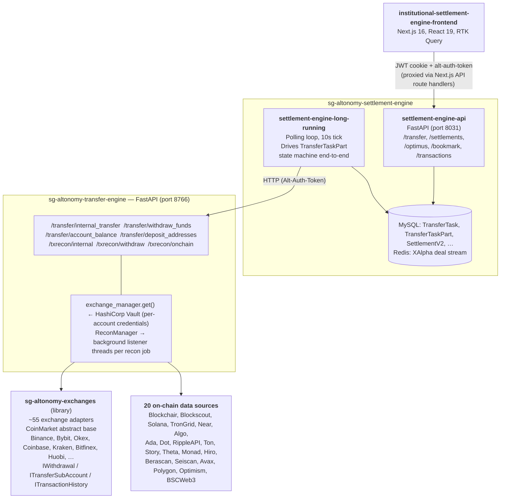

# Altex — System Overview

Altex = Altonomy fund-movement and settlement platform. This doc orient you: which service own which behaviour, what each workflow phase do, what each status mean. So you aim queries at right service, table, or log stream.

Sibling references:

- [`altex-db-schema.md`](./altex-db-schema.md) — table/column detail behind models named here.
- [`logging-and-loki.md`](./logging-and-loki.md) — how pull logs for these services.
- [`error-codes.md`](./error-codes.md) — decode exchange error codes surfaced by exchanges library.

---

## 1. Business context

Altex move assets between accounts and venues for Altonomy institutional desks (OTC, market-making). Two movement categories:

- **Internal rebalancing.** Move firm own assets — between sub-accounts and main accounts on one exchange, between exchanges, between spot/margin/futures wallets. Invisible to external counterparty.
- **External OTC settlement.** Deliver asset to external client wallet/account (on-chain transfer or bank wire) once deal booked, and recognise incoming leg from counterparty. One settlement may chain several internal moves before final external withdrawal.

Users = **internal Altonomy staff** (OTC traders, MMs, Middle Office, settlement ops), not external counterparties. System optimise for operator visibility, manual override, audit trails, recoverability.

Core responsibilities:

1. **Routing** — given source, destination, asset, amount, compute path of one+ legs (e.g. *Binance sub → Binance main → on-chain withdrawal → counterparty wallet*).
2. **Execution** — call right exchange/blockchain API for each leg with right credentials.
3. **Reconciliation** — independently verify funds actually left source and arrived at destination, by querying exchange transaction histories and on-chain explorers. This distinguish "we initiated transfer" from "transfer completed".
4. **Settlement matching** — tie executed transfers back to deals booked upstream so firm books mark trades settled.
5. **Reporting and audit** — per-settlement audit trail of every exchange and on-chain transaction involved.

Adjacent systems consumed (not owned) by Altex:

- **Optimus** — master data for accounts, counterparties, portfolios, instruments, settlement methods, blockchain networks. Also mint JWTs used across all services (its `auth_api`).
- **XAlpha** — deal management. Deals stream into Altex via Redis as booked; Altex flag them settled once matching fund movement completes.
- **Vault (HashiCorp)** — hold exchange API keys, scoped per account.
- **ComplyAdv** — compliance screening for counterparty transactions.

### Architecture



### Layering rationale

Split between settlement engine and transfer engine separate **business workflow** from **mechanical execution**:

- **Settlement engine** own *what should happen and why*: tasks, parts, recon state, settlement matching, deal linkage, OTP gates, audit. System of record, only service that talk to database.
- **Transfer engine** own *how it actually happen*: pick right exchange adapter, present right credentials, call right endpoint, verify result. Intentionally stateless — can restart, scale horizontally, or replace without data-loss concern.
- **Exchanges package** own *vendor-specific quirks*: signing, rate limits, response shapes, error codes, symbol normalisation. As library, same adapter code reused without network hop.

Settlement engine *never* talk directly to exchange or blockchain — every venue interaction go through transfer engine, which centralise credential handling and recon logic.

---

## 2. The core workflow: TransferTask lifecycle

Heart of Altex = **TransferTask** state machine. Every fund movement — internal rebalance or external settlement — is Task made of one+ **Parts** (legs).

### 2.1 Task creation (settlement-engine-api)

Task originate from several entry points (all under `/settlement_engine_api/transfer`, all `POST`):

- Operator fill out `/new-transfer` in frontend → `create`.
- Bulk CSV upload → `bulk_create`.
- Bulk QMS upload → `qms`.
- Internal-only move from MO → `create_internal`.
- Recon-only record for transfer executed out-of-band → `create_external_recon_task`.
- Deal arriving on XAlpha Redis stream, triggering automatic settlement creation.

When task carry settlement, API first compute path via `path` or `path_settlement`, which route from source account to either internal destination or external OTC wallet. Resulting path become ordered list of `TransferTaskPart` rows. Each part has own source/destination accounts and addresses, asset, amount, `transfer_method`.

Task land in status `running` (or `paused` if approval required); each part start in `pending`.

> **`transfer_method` is free-text string, not enum.** In `TransferLongRunningCtrl.start_transfer_part`, **empty string** means internal/exchange transfer (routed via `do_internal_transfer`); **non-empty value is chain name** for on-chain withdrawal (routed via `do_external_transfer`). No enumerated "bank wire" / "cross-account" type. Nearest real enum = `TransferTaskType` (`internal`, `external incoming`, `external outgoing`), which classify task direction, not its rail.

### 2.2 Part execution (settlement-engine-long-running)

Long-running process (`python -m altonomy.settlement_engine.process_transfer`) run single loop every 10 seconds. Each tick, module-level functions in `process_transfer` call, **in this exact order**, delegating to `TransferLongRunningCtrl` instance (`altonomy.settlement_engine.ctrls.transfer_long_running_ctrl`):

| Stage | Function | What it does |
| :--- | :--- | :--- |
| 1 | `process_part_waiting` | Check parent task is `running` and prerequisites met, then promote part `waiting → running`. |
| 2 | `process_transfer` | Either skip (incoming-only parts have nothing to push) or call transfer engine — `do_internal_transfer` for exchange cross-account moves, `do_external_transfer` for on-chain withdrawals. Record returned txn / internal id. Transition `running → transfer initiated`. |
| 3 | `process_recon` | Start (or poll) **source reconciliation**: prove transfer left source. POST to transfer engine `/txrecon/withdraw` or `/txrecon/internal` with deterministic recon id. Store id in `recon_id_src`; poll for `recon confirmed` or `failed`. |
| 4 | `resolve_dest_recon` | Start (or poll) **destination reconciliation**: prove transfer arrived. On-chain destinations hit `/txrecon/onchain`. Store id in `recon_id_dest`. On confirmation, transition part `transfer initiated → completed`; when all parts complete, task go to `completed`. |

Parts can fail at any active stage (→ `failed`) or be cancelled by operator action (→ `cancelled`). Internal-exchange parts bypass on-chain destination recon (no chain involvement). Every state transition logged for audit.

### 2.3 Reconciliation (transfer-engine)

Reconciliation = what make system trustworthy: initiating transfer easy; *proving* it landed is the product. Transfer engine implement recon as long-running listener threads managed by process-wide `ReconManager` (module-level instance `recon_manager` in `altonomy.txengine.recon_manager`). Four listener classes inherit from common base `BaseReconListener` (`class BaseReconListener(ABC, threading.Thread)`):

- **`InternalReconListener`** — poll exchange transfer history for record matching expected currency, amount, time window.
- **`WithdrawReconListener`** — match by withdrawal id returned at execution time.
- **`DepositReconListener`** — match incoming deposits on destination exchange.
- **`OnChainReconListener`** — fan out across on-chain data sources, each checked for transaction matching expected from/to addresses; first successful match wins.

Four `/txrecon` endpoints = `internal`, `withdraw`, `onchain`, `status`/`cancel`. **No `/txrecon/deposit` route** — deposit recon reached through `POST /txrecon/onchain` (`ReconManager.new_onchain_tx_recon` branch to `DepositReconListener` when `account_id` present, else to `OnChainReconListener`).

**Recon-id idempotency.** Recon ids deterministic, computed by *settlement engine* (caller), then passed to transfer engine. `TransferLongRunningCtrl._generate_recon_id(task_id, part_id, direction)` return `str(uuid5(RECON_NAMESPACE, f"{task_id}-{part_id}-{direction}").int)`, where `RECON_NAMESPACE` come from `config.RECON_NAMESPACE`. Because id is pure function of task/part/direction, recon poll is idempotent and re-entrant: transfer engine reuse supplied `recon_id` if present (`ReconManager._generate_recon_id`), so restarting either service does not lose state — next tick query same id and resume. (If caller omit id, transfer engine fall back to random `str(uuid4().int)`.)

### 2.4 Settlement matching

For settlement-type tasks, completion does not end workflow — deal must be marked settled in OTC books:

1. Settlement row (created when deal arrived from XAlpha) matched against completed `TransferTask`. Link = `transfer_task_id` column on settlement ↔ `task_id` on `TransferTask`, plus `deal_ref`. (`settle_id` and `x_deal_ref` live on `TransferTask`, not on settlement.)
2. Settlement `filled` flag flipped to true.
3. `XAlphaCtrl.settle_deal_by_deal_ref` (`altonomy.settlement_engine.external.xalpha_ctrl`) push settlement status back to XAlpha (`PUT …/xalpha_api/deal/update/deal_ref/{deal_ref}`) so trading system reflect reality.
4. Audit endpoint `GET /settlements/audit/{settlement_id}` render full chain: deal → settlement → task → parts → exchange txns + on-chain txns (looked up via external Txn service).

> **Active settlement model = `SettlementV2`.** `/settlements` route group served by `settlements_v2_api` and backed by `SettlementV2` (+ `SettlementV2Match`) and `SettlementV2Ctrl`. Legacy v1 `Settlement` model / `settlements_api` / `SettlementCtrl` still exist in tree but **not wired into live router**. V2 surface use match/unmatch routes (e.g. `unmatch`, `{settlement_id}/match`) for reconciling mismatches; **no bare `/settlements/settle` or `/settlements/unsettled/{id}`** route.

---

## 3. Repository breakdown

### 3.1 `sg-altonomy-exchanges` — exchange abstraction library

**Type:** Python library (Poetry-packaged). Not service; consumed by other services. Package root `altonomy/exchanges/`.

**Surface area:** roughly **55 concrete exchange adapters** (about 57 `CoinMarket`-descendant classes counting two scaffolds, `Myexchange` in `TEMPLATE.py` and `Tinyex`; spread across ~59 adapter-bearing modules). Earlier "~78" figure = overcount.

**Core abstractions:**

- `CoinMarket` (`altonomy.exchanges.CoinMarket`, ~2,800 LOC) — abstract base every adapter extend (`class CoinMarket(IWallet)`). Define contract for market data, balances, orders, signing, error handling, rate limiting, response caching (`CachedEndpoint`/`TTLCache`), Redis fallback (`RedisFallback`).
- Three interfaces in `altonomy.exchanges.Wallet` — `ITransactionHistory`, `ITransferSubAccount`, `IWithdrawal` — capturing operations Altex need: pull transaction history, move funds between sub-accounts, initiate on-chain withdrawals. (`IWallet` also defined here.)
- Factory `Exchange(exchange_name, ACCESS_KEY="", SECRET_KEY="", …)` in `altonomy.exchanges.__init__` dynamically import concrete class by name (`importlib.import_module("altonomy.exchanges.{name}")` then `getattr(module, name)`). Sibling `ExchangeClass(name)` return class without instantiating.

**Why it matter:** transfer engine treat every venue uniformly. Binance withdrawal call `Binance().make_withdrawal(...)`; OKX sub/main move call `Okex().transfer_funds(...)` (OKX class literally named `Okex`; newer `Okexv5` also exists). Adding venue = writing new adapter against these interfaces — no settlement-engine or transfer-engine changes.

**Representative adapter — Binance** (`altonomy.exchanges.Binance`, ~3,000 LOC): `class Binance(IWithdrawal, ITransferSubAccount, ITransactionHistory, CoinMarket)`. Cover spot (with margin/futures in sibling modules `Binancemargin`, `Binancedm`, `Binancedmc`, `Binancepm`, `Binanceus`), sub-account/transfer history, `universal_transfer`, `make_withdrawal`, `transfer_funds`, deposit addresses, WebSocket user-data stream. HMAC-SHA256 signing on authenticated requests.

### 3.2 `sg-altonomy-transfer-engine` — fund movement & reconciliation service

**Type:** Stateless FastAPI service, port 8766, no database. Entrypoint `uvicorn altonomy.txengine.main:app`.

**Responsibilities:**

- **Credential resolution.** `altonomy.txengine.exchange_manager` expose module-level `get(exchange_name, account_id, use_cache=True)` function (not class). Read per-account keys from HashiCorp Vault (`hvac`) on demand and cache adapter instances in `cachetools.LRUCache` keyed by `(exchange_name, account_id)`; credentials re-fetched on every call and cached adapter reused only if still match.
- **Transfer execution.** `POST /transfer/internal_transfer` and `POST /transfer/withdraw_funds` route to right adapter call.
- **Read APIs.** `GET /transfer/withdrawal_fees`, `GET /transfer/account_balance`, `GET /transfer/deposit_addresses`, `GET /transfer/transfer_history`, `GET /transfer/account_uid`.
- **Reconciliation.** Listener classes (§2.3) inheriting `BaseReconListener`, tracked by `recon_manager` in `active_recons`; finished jobs land in `completed_recons` LRU. Recon routes: `POST /txrecon/internal`, `POST /txrecon/withdraw`, `POST /txrecon/onchain`, `GET /txrecon/status`, `POST /txrecon/cancel`.
- **On-chain coverage.** **20** concrete sources behind abstract base `OnChainSource` (`altonomy.txengine.recon_sources.on_chain_source`, with `find_tx` and `supports` classmethod), also enumerated in `SOURCES` tuple of `on_chain_recon_listener`: `Ada, Algo, Avax, Berascan, Blockchair, Blockscout, BSCWeb3, Dot, Hiro, Monad, Near, Optimism, Polygon, RippleAPI, Seiscan, Solana, Story, Theta, Ton, TronGrid`.

**Authentication.** Every route handler first call = `validate_token(alt_auth_token, [scope])` (`altonomy.txengine.utils`), which POST to `{ALT_CLIENT_ENDPOINT}/auth_api/auth/verify`. Scopes single-valued per route, drawn from `altex_admin_read`, `altex_admin_create`, `altex_admin_update`.

**Routing note.** Two mounted routers use prefixes `/transfer` and `/txrecon` only — **no `/transfer_engine_api/` mount prefix**.

**Logging.** Loguru, two file sinks under `~/logs/txengine/`: general sink (`altonomy.log`) and recon-listener sink (`recon_listeners.log`, bound by `recon_id`). Both rotate at 500 MB, retain 7 days, compress with LZMA. See [`logging-and-loki.md`](./logging-and-loki.md).

### 3.3 `sg-altonomy-settlement-engine` — business workflow & persistence

**Type:** Python / FastAPI / SQLAlchemy / MySQL / Redis. One codebase, multiple processes; two in scope here.

#### `settlement-engine-api` (port 8031)

Entrypoint `uvicorn altonomy.settlement_engine.main:app`. REST surface mount `api_router` under `/settlement_engine_api`, with these route groups:

- **`/transfer`** — operator-facing transfer-task CRUD: create (`create`, `create_internal`, `bulk_create`, `qms`, `create_external_recon_task`), read (filters, pagination, live vs. historical, single task, part lists, per-part balance), task/part overrides (below), path endpoints (`path`, `path_settlement`).
- **`/settlements`** — served by `settlements_v2_api` (`SettlementV2`): listing with filters, audit trail (`audit/{settlement_id}`) with full transaction lookup, match/unmatch, bulk creation. Deal-management linkage live here.
- **`/optimus`** — read-through proxy of upstream master-data system (instruments, prices, accounts, counterparties, portfolios, settlement methods, blockchain networks), plus `force_sync` endpoint.
- **`/bookmark`** — operator UI bookmarks (saved filters).
- **`/transactions`** — historical ledger queries.

(Separate report app, `main_report`, expose `/report` surface on different port; not part of operator API above.) All routes gated by `altex_admin_*` scopes via `api_utils.get_jwt_payload`, which verify remotely against Optimus `/auth_api/auth/verify` — scopes not defined in this repo.

**Override / manual-action routes** (under `/transfer`):

- Task level: `{task_id}/pause`, `{task_id}/resume`, `{task_id}/cancel`.
- Part level: `{task_id}/part/{part_id}/skip`, `{task_id}/part/{part_id}/force-cancel`, `{task_id}/part/{part_id}/restart`.

#### `settlement-engine-long-running`

Single-instance polling loop, 10-second tick, drive every active `TransferTaskPart` through its state machine (see §2.2 for four ordered functions).

**Part** state machine (`TransferTaskPartStatus`, stored as lowercase string values shown):

```mermaid
stateDiagram-v2
    [*] --> pending
    pending --> waiting
    waiting --> running
    running --> "transfer initiated"
    "transfer initiated" --> completed
    completed --> [*]

    pending --> failed: any failure
    waiting --> failed: any failure
    running --> failed: any failure
    "transfer initiated" --> failed: any failure

    pending --> cancelled: operator action
    waiting --> cancelled: operator action
    running --> cancelled: operator action
    "transfer initiated" --> cancelled: operator action

    failed --> [*]
    cancelled --> [*]
```

Authentication handled at startup via JWT login against Optimus (`POST {OPTIMUS_EP}/auth_api/auth/login`), refreshed every 30 minutes, presented as `Alt-Auth-Token` header on every downstream call (case-insensitive). `deal_subscriber` worker log in similarly.

#### Status enums

All in `altonomy.settlement_engine.enums`, defined as `(str, Enum)` — **lowercase string value** is what persisted and serialized; CamelCase name = just Python identifier.

`TransferTaskStatus` (task header):

| Python member | Stored value |
| :--- | :--- |
| `Running` | `running` |
| `Paused` | `paused` |
| `PartiallyCompleted` | `partially completed` |
| `Completed` | `completed` |
| `Failed` | `failed` |
| `Cancelled` | `cancelled` |

`TransferTaskPartStatus` (per-leg state machine):

| Python member | Stored value |
| :--- | :--- |
| `Pending` | `pending` |
| `Waiting` | `waiting` |
| `Running` | `running` |
| `TransferInitiated` | `transfer initiated` |
| `Completed` | `completed` |
| `Failed` | `failed` |
| `Cancelled` | `cancelled` |

`TransferTaskPartReconStatus` (per-direction recon outcome, stored in `recon_id_src` / `recon_id_dest` partners and recon-status fields):

| Python member | Stored value |
| :--- | :--- |
| `UnknownExternal` | `unknown_external` |
| `Pending` | `pending` |
| `Started` | `started` |
| `Sending` | `sending` |
| `ConfirmedRecon` | `recon confirmed` |
| `ConfirmedManual` | `manual confirmed` |
| `Failed` | `failed` |

> Note literal value of `ConfirmedRecon` is `recon confirmed`, not `ConfirmedRecon`. Separate, smaller `ReconCheckStatus` (`success`/`error`) used for recon-check results — do not conflate with per-part recon status. Also derived, display-only `TransferTaskDisplayStatus` used by UI (e.g. `pending approval`, `completed (no dest recon)`, `partially failed`) — not persisted task status.

#### Core domain models (`altonomy.settlement_engine.models`)

| Model | Purpose |
| :--- | :--- |
| `TransferTask` | Header row for single user-requested fund movement. Track `status`, total amount, source/destination accounts, `task_id`, optional `settle_id`, maker (creator), `x_deal_ref`. |
| `TransferTaskPart` | One leg. Track `transfer_method`, addresses, amount, txn/internal id, `recon_id_src` and `recon_id_dest`, source and destination recon status, recon logs, per-part state machine. |
| `SettlementV2` (+ `SettlementV2Match`) | Active OTC-deal / manual settlement record. Carry direction, counterparty, asset, amount, `filled` flag, `deal_ref` / `deal_id`, `transfer_task_id` link to its task. (Legacy `Settlement` model present but unwired.) |
| `Fee` | Recorded transfer fees, looked up at recon time and surfaced in reporting. |

See [`altex-db-schema.md`](./altex-db-schema.md) for full column detail.

#### External integrations

| System | Direction | Purpose |
| :--- | :--- | :--- |
| sg-altonomy-transfer-engine | outbound | Execute transfers, run recon |
| Optimus | bidirectional | Master data (in), JWT auth, settlement creation (out) |
| XAlpha (Redis stream `STREAM:XALPHA:SETTLEMENT`) | inbound | Deal events → settlement creation (`DealSubscriber`, via `xreadgroup`) |
| XAlpha (HTTP) | outbound | Flag deals as settled (`XAlphaCtrl`) |
| Txn service | outbound | Look up exchange + blockchain txns for audit trail |

### 3.4 `institutional-settlement-engine-frontend` — operator console

**Type:** Next.js 16 + React 19, App Router. SSR/RSC for shell, Redux Toolkit + RTK Query for client data, AG Grid Enterprise (unscoped `ag-grid-enterprise` v34) for dense tables, Ant Design v5 + Tailwind for rest. App directory `src/app`.

**Route groups.** Pages live under `src/app/(pages)`, split into `(login)` (single `/login` page) and `(base)` (authenticated screens). API route handlers and `healthz` live under `src/app/(routes)`.

**Key pages** (under `(base)`):

| Route | Purpose |
| :--- | :--- |
| `/outstanding` (home) | All active settlement obligations — operator dashboard. |
| `/new-transfer` | Create single transfer. |
| `/bulk-transfer` | CSV-driven bulk creation. |
| `/transfers` | Live and historical requests with state, recon status, manual-action buttons. |
| `/txn-validation` | Validate pending on-chain transactions before they execute. |
| `/balances` | Live balances across exchange and bank accounts. |
| `/manage`, `/settlement-report`, `/client-activity-report`, `/option-settlement-report` | Reporting and back-office settlement management. |
| `/txn-statement/account`, `/txn-statement/bank` | Historical transaction ledger (section, not single page). |
| `/whitelisting` | Withdrawal address whitelisting. |

**Authentication / proxy.** Login post to Optimus `auth_api` (`/auth/login`, or `/auth/login_otp` for OTP) via `"use server"` action; JWT stored in `httpOnly`, `Secure` cookie named `JWT`. Browser never talk to Python services directly — each `/api/*` endpoint is own Next.js route handler under `src/app/(routes)/api/.../route.ts` that read `JWT` cookie, return 401 if absent, forward it upstream as `alt-auth-token` header to settlement engine (`settlement_engine_api`), account/auth services (`account_api`, `auth_api`), or client-report API. (Separate page-navigation middleware redirect to `/login` when cookie missing but does not do header rewrite.)

**Data fetching.** RTK Query slices in `src/app/store/services/`: `settlementsApi`, `transferApi`, `outstandingsApi`, `balancesApi`, `userApi`, `transactionsApi`, `clientActivityReportApi`, `bookmarksApi`, `settlementMethodsApi`, `fileDownloadApi`. Each give normalised cache, request deduping, tag-based invalidation; each user action re-fetch only slices it touched.

**OTP.** Login flow profile-driven: if password login response carry `use_otp`, user switched to six-digit OTP form that re-call login against `/auth/login_otp`.

---

## 4. End-to-end example: an external OTC settlement

Desk sell 100 BTC to external OTC counterparty, delivered from Binance sub-account.

1. **Deal arrives.** Trade booked in XAlpha, which publish it to `STREAM:XALPHA:SETTLEMENT` on Redis.
2. **Settlement created.** Settlement engine `DealSubscriber` read stream and insert settlement row (outgoing, BTC, 100, counterparty, `filled=false`).
3. **Operator creates transfer.** Settlement-ops user open `/outstanding`, see unsettled deal, trigger settlement. Frontend call `POST /transfer/path_settlement` to compute route — say, *Binance-sub → Binance-main → on-chain withdrawal to client wallet*. Operator confirm, supplying OTP if required.
4. **Task persisted.** `settlement-engine-api` write one `TransferTask` and its `TransferTaskPart` rows. Task start `running`; parts start `pending`.
5. **Long-running picks it up.** On next 10-second tick:
   - Promote part 1 (sub → main) `waiting → running`.
   - Call transfer engine `POST /transfer/internal_transfer` with Binance account id.
   - Transfer engine fetch Binance credentials from Vault, instantiate `Binance` adapter, call `universal_transfer`, record internal id.
   - Part move to `transfer initiated`; long-running service start internal recon (`POST /txrecon/internal`).
   - Transfer engine `InternalReconListener` poll Binance transfer history until find match, then resolve to `recon confirmed`.
   - On later tick, source recon is `recon confirmed`, destination recon for internal sub→main hop bypassed, part marked `completed`.
6. **Repeat for part 2** (Binance main → external client wallet via on-chain withdrawal): transfer is `POST /transfer/withdraw_funds`, source recon is withdraw recon, destination recon is `OnChainReconListener` querying on-chain sources for Bitcoin transaction matching expected address, amount, time window.
7. **Task completes.** All parts done → task `completed`.
8. **Settlement filled.** Settlement engine match completed task to settlement row (via `transfer_task_id` / `deal_ref`), set `filled=true`, call `XAlphaCtrl.settle_deal_by_deal_ref` so desk see deal settled.
9. **Audit available.** `GET /settlements/audit/{settlement_id}` retrieve full chain: deal → settlement → task → parts → Binance internal transfer → on-chain BTC transaction (via Txn service).

Same flow, with different `transfer_method` values, handle internal-only rebalances (no on-chain leg), exchange-to-exchange moves, multi-asset settlements where base and quote settle independently.

---

## 5. Cross-cutting concerns

**Idempotency.** Recon ids = deterministic UUIDs derived from `task_id`, `part_id`, direction (computed in settlement engine, reused by transfer engine). Restarting any service does not duplicate work: next recon call treated as status query for existing job.

**Authentication.** Optimus `auth_api` mint JWTs that flow as `alt-auth-token` (case-insensitive) through every service. RBAC uniform: three scopes — `altex_admin_read`, `altex_admin_create`, `altex_admin_update` — gate routes, verified remotely against `/auth_api/auth/verify`.

**Credentials.** Exchange API keys never in code or env. Transfer engine fetch them from HashiCorp Vault on demand, scoped per `account_id`, and cache resulting adapter. Rotating key = Vault operation, no deploy.

**Observability.** Transfer engine write dual Loki-ingestible log streams (general + recon-listener, latter keyed by `recon_id`) with 7-day retention and LZMA compression. Settlement engine write per-part recon log blobs into MySQL, retrievable via audit endpoint. See [`logging-and-loki.md`](./logging-and-loki.md).

**Manual overrides.** Every automated action has manual counterpart: pause/resume/cancel task, skip/force-cancel/restart part, match/unmatch settlements, and `create_external_recon_task` for transfers executed out-of-band. Altex assume operators sometimes know more than system and let them say so.

**Scalability boundaries.** Settlement engine = single source of truth, not sharded; long-running process = single instance to avoid double-driving state machine. Transfer engine stateless — can run any number of replicas. Exchanges library has no shared state.

---

## 6. Glossary

- **Part / TransferTaskPart** — one leg of multi-leg fund movement.
- **Task / TransferTask** — single operator-requested or deal-triggered fund movement, made of one+ Parts.
- **Settlement** — obligation tied to booked deal (or manual ledger item). Become `filled` once matching completed Task exists. Active model = `SettlementV2`.
- **Recon** — independent verification, by polling exchange API or blockchain explorer, that transfer actually happened. Distinct from "initiated".
- **MO** — Middle Office. Internal ops team that request rebalancing.
- **OTC** — Over-the-counter. Desk external counterparties.
- **XAlpha** — upstream deal-management system. Source of settlement obligations.
- **Optimus** — upstream master-data and auth system. Source of accounts, counterparties, settlement methods, JWTs.
- **Nitro Account** — Altonomy internal account identifier; mapped to per-venue UIDs by transfer engine.